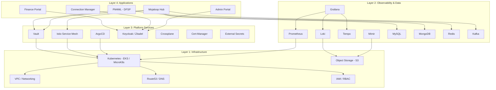
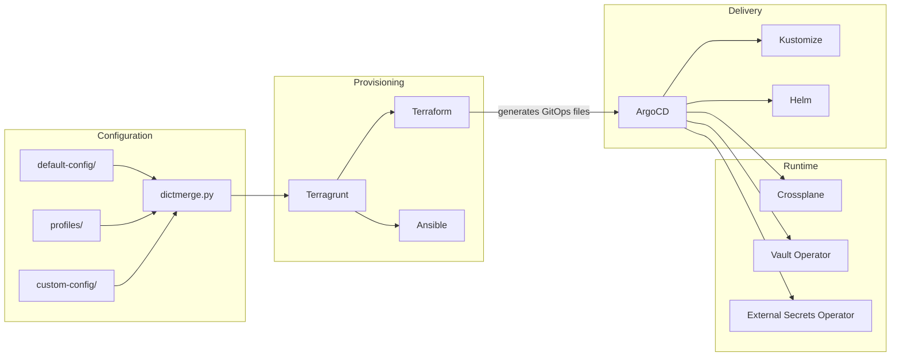
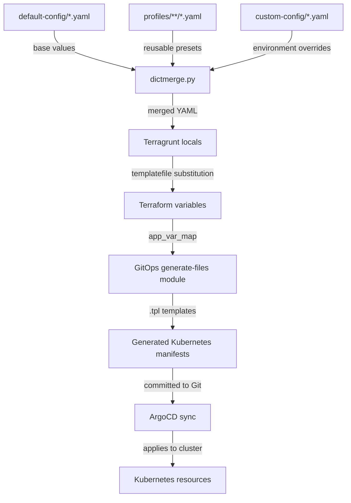
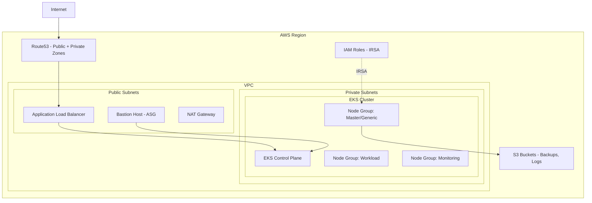
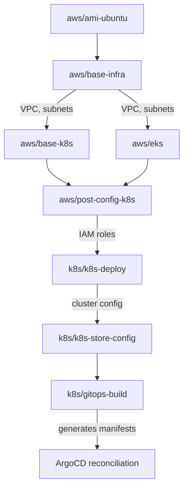
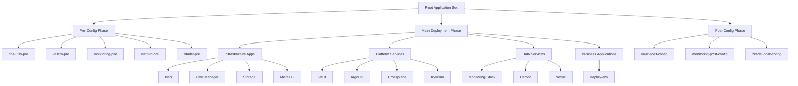
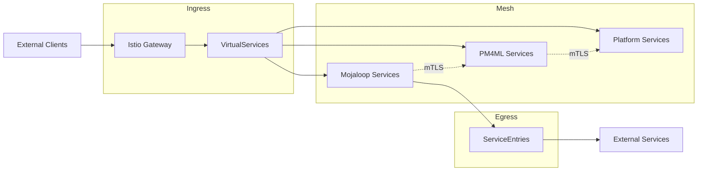
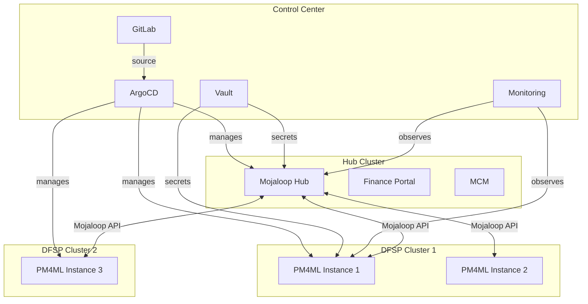

# Architecture Guide

This document describes the architecture of the Mojaloop IaC Modules platform, covering infrastructure layers, component relationships, data flows, and deployment topology.

## High-Level Architecture

The platform is organized into four distinct layers, each building on the layer below:



## IaC Toolchain Architecture

The deployment pipeline uses multiple IaC tools, each responsible for a specific layer:



### Tool Responsibilities

| Tool | Layer | Responsibility |
|------|-------|---------------|
| **Terraform** | Infrastructure | Provisions cloud resources (VPC, EKS, IAM, Route53) and generates GitOps manifests |
| **Terragrunt** | Orchestration | Manages Terraform module dependencies, configuration injection, and state backends |
| **Ansible** | Node Configuration | Configures Kubernetes nodes, installs MicroK8s, manages host-level settings |
| **ArgoCD** | Application Delivery | Continuously reconciles Kubernetes desired state from Git |
| **Kustomize** | Manifest Customization | Applies environment-specific overlays to base manifests |
| **Helm** | Package Management | Deploys complex applications via parameterized charts |
| **Crossplane** | Runtime IaC | Provisions cloud resources declaratively from within Kubernetes |
| **Vault Operator** | Secrets | Synchronizes secrets between Vault and Kubernetes |

## Configuration Flow



### Configuration Merge Order

The `dictmerge.py` utility performs recursive deep merging. Later layers override earlier ones:

```
1. default-config/common-vars.yaml        (base platform settings)
2. default-config/cluster-config.yaml      (cluster topology)
3. default-config/mojaloop-vars.yaml       (Mojaloop feature flags)
4. default-config/pm4ml-vars.yaml          (PM4ML settings)
5. default-config/platform-stateful-resources.yaml  (database configs)
6. profiles/**/profile-name.yaml           (reusable profile overrides)
7. custom-config/**/*.yaml                 (environment-specific overrides)
```

> See [Configuration Reference](./configuration-reference.md) for all available configuration keys.

## Infrastructure Architecture

### AWS Deployment



### Terraform Module Dependency Chain



### Private Cloud Deployment

For on-premises deployments, the architecture replaces AWS-managed services:

| AWS Service | Private Cloud Replacement |
|------------|--------------------------|
| EKS | MicroK8s (single or multi-node) |
| ALB | MetalLB + Nginx Ingress |
| Route53 | External DNS with supported provider |
| EBS | OpenEBS / Rook-Ceph |
| S3 | MinIO / Ceph Object Storage |
| RDS | Percona XtraDB Cluster (in-cluster) |
| IAM/IRSA | Kubernetes ServiceAccount + Vault |

## GitOps Architecture

### ArgoCD Application Hierarchy



### Three-Phase Deployment Model

All applications follow a three-phase deployment lifecycle:

| Phase | Purpose | Examples |
|-------|---------|---------|
| **Pre-Config** | Provision prerequisites (namespaces, CRDs, storage) | `monitoring-pre`, `velero-pre`, `zitadel-pre` |
| **Main** | Deploy the core application (Helm charts, operators) | `vault`, `istio`, `monitoring`, `harbor` |
| **Post-Config** | Configure integrations, seed data, set up connections | `vault-post-config`, `monitoring-post-config` |

### Overlay System

Applications support environment-specific customization through Kustomize overlays:

```
applications/
├── base/                     # Base manifests (all environments)
│   └── vault/
│       ├── kustomization.yaml
│       └── helm-release.yaml
└── overlays/
    ├── cloud_provider/       # Cloud-specific (aws/, private-cloud/)
    ├── k8s_provider/         # K8s distro-specific (eks/, microk8s/)
    ├── rdbms_provider/       # Database backend (rds/, in-cluster/, dbaas/)
    └── mongodb_provider/     # MongoDB backend (dbaas/)
```

## Data Architecture

### Stateful Resources

The platform manages stateful resources through three provisioning strategies:

| Strategy | Description | Use Case |
|----------|-------------|----------|
| **Local Helm** | Deploys databases via Helm charts within the cluster | Development, testing |
| **Operator-Managed** | Uses Kubernetes operators (Percona, Redis) for lifecycle management | Production (private cloud) |
| **Cloud-Managed** | Leverages cloud-managed services (RDS, ElastiCache) via Crossplane | Production (AWS) |

### Core Data Services

| Service | Technology | Purpose |
|---------|-----------|---------|
| **Central Ledger DB** | MySQL | Financial transaction records |
| **Account Lookup** | MySQL | Participant and account resolution |
| **Quoting Service DB** | MySQL | Quote storage and retrieval |
| **Settlement DB** | MySQL | Settlement window management |
| **Object Store** | MongoDB | Document and bulk transfer storage |
| **Cache** | Redis | Session state and caching |
| **Event Streaming** | Kafka | Asynchronous event processing |
| **Metrics Storage** | Mimir (S3-backed) | Long-term metrics retention |
| **Log Storage** | Loki (S3-backed) | Centralized log aggregation |
| **Trace Storage** | Tempo (S3-backed) | Distributed trace storage |

## Network Architecture

### Service Mesh (Istio)



### DNS Architecture

- **Public Zone** — External-facing services (portals, APIs)
- **Private Zone** — Internal service discovery
- **External DNS** — Automatic DNS record management from Kubernetes Ingress/Service resources

### Load Balancing

| Environment | Technology | Configuration |
|------------|-----------|---------------|
| AWS (EKS) | Application Load Balancer (ALB) | Provisioned via Terraform |
| Private Cloud | MetalLB | Layer 2 or BGP mode |

## Security Architecture

See [Security Architecture](./security-architecture.md) for the comprehensive security reference. Key highlights:

- **Zero-Trust Networking** — Istio mTLS between all services
- **Secrets Management** — HashiCorp Vault with Kubernetes auth backend
- **Identity Provider** — Keycloak (OIDC) + Zitadel for centralized authentication
- **Policy Engine** — Kyverno for Kubernetes admission control
- **Certificate Management** — Cert-Manager with Let's Encrypt or internal CA
- **RBAC** — Ory stack (Keto, Oathkeeper) for fine-grained API authorization
- **JWS/mTLS** — Interledger Protocol security between Hub and DFSPs

## Multi-Cluster Topology



## Next Steps

- [Getting Started](./getting-started.md) — Set up your first deployment
- [Deployment Guide](./deployment-guide.md) — Detailed deployment procedures
- [Configuration Reference](./configuration-reference.md) — All configuration options
