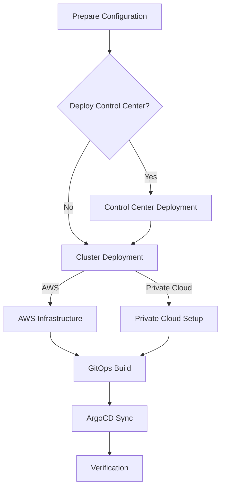

# Deployment Guide

This guide covers step-by-step deployment procedures for all supported deployment types: Control Center, Hub Cluster (AWS and Private Cloud), and DFSP (PM4ML) environments.

## Deployment Overview



## Phase 1: Control Center Deployment (Optional)

The Control Center provides centralized management for multiple Mojaloop clusters. Skip this phase if you already have an existing management environment.

### 1.1 Prepare Configuration

```bash
cd terraform/ccnew

# Review and customize configuration
vi custom-config/cluster-config.yaml
```

Minimum required settings:

```yaml
cluster_name: cc-prod
domain: cc.mojaloop.example.com
cloud_platform: aws
cloud_region: eu-west-1
k8s_cluster_type: microk8s

vpc_cidr: "10.106.0.0/23"

nodes:
  master:
    master-generic:
      node_count: 3
      instance_type: m5.2xlarge
      master_node: true
      master_node_supports_traffic: true
```

### 1.2 Set Environment Variables

```bash
source scripts/setlocalvars.sh
```

### 1.3 Merge Configurations

```bash
bash scripts/mergeconfigs.sh
```

### 1.4 Deploy Infrastructure

```bash
# Step 1: Deploy Kubernetes cluster (MicroK8s nodes on EC2)
cd k8s-deploy
terragrunt apply

# Step 2: Deploy Control Center services (GitLab, Vault, ArgoCD)
cd ../control-center-deploy
terragrunt apply

# Step 3: Post-deployment configuration (backups, DNS, email)
cd ../control-center-post-deploy
terragrunt apply
```

### 1.5 Verify Control Center

```bash
# Check nodes
kubectl get nodes

# Verify GitLab is running
kubectl get pods -n gitlab

# Check Vault status
kubectl exec -n vault vault-0 -- vault status
```

---

## Phase 2: AWS Hub Cluster Deployment

### 2.1 Prepare Configuration

```bash
cd terraform/k8s

# Review default configuration files
ls default-config/

# Create custom overrides
vi custom-config/cluster-config.yaml
vi custom-config/mojaloop-vars.yaml
```

#### Example: Hub Cluster Configuration

**`custom-config/cluster-config.yaml`:**

```yaml
cluster_name: hub-prod
domain: hub.mojaloop.example.com
cloud_platform: aws
cloud_region: eu-west-1
k8s_cluster_type: eks
environment: production

kubernetes_version: "1.32"

vpc_cidr: "10.25.0.0/16"
az_count: 3

nodes:
  master:
    master-generic:
      node_count: 3
      instance_type: m5.2xlarge
  agent:
    mojaloop-workload:
      node_count: 3
      instance_type: m5.4xlarge
      node_labels:
        workload-class: mojaloop
    monitoring:
      node_count: 2
      instance_type: m5.2xlarge
      node_labels:
        workload-class: monitoring

tags:
  Environment: production
  Project: mojaloop
  ManagedBy: terraform
```

**`custom-config/mojaloop-vars.yaml`:**

```yaml
mojaloop_enabled: true
bulk_enabled: false
third_party_enabled: false
ttk_enabled: true
finance_portal_enabled: true
mcm_enabled: true
```

### 2.2 Deploy AWS Infrastructure

```bash
cd terraform/k8s

# Set environment
source setlocalvars.sh

# Step 1: Deploy EKS cluster and networking
cd k8s-deploy
terragrunt apply
```

This creates:
- VPC with public and private subnets
- EKS cluster with managed node groups
- Application Load Balancers (internal and external)
- Security groups for cluster communication
- Route53 DNS zones (public and private)
- NAT Gateways for outbound internet access

### 2.3 Store Cluster Configuration

```bash
cd ../k8s-store-config
terragrunt apply
```

This persists cluster metadata (endpoint, certificate, token) for downstream modules.

### 2.4 Build GitOps Configuration

```bash
cd ../gitops-build
terragrunt apply
```

This generates:
- ArgoCD Application manifests for all enabled services
- Helm value files with cluster-specific settings
- Kustomization overlays for the target cloud provider
- Vault configuration for secrets management
- Monitoring stack configuration (Prometheus, Grafana, Loki)

### 2.5 Deploy Applications via ArgoCD

ArgoCD automatically syncs applications from the generated manifests. The deployment follows three phases:

**Pre-Config Phase:**
- DNS utilities and certificate setup
- Object storage for monitoring backends
- Velero backup prerequisites
- Identity provider prerequisites

**Main Deployment Phase:**
- Istio service mesh
- Vault secrets management
- Monitoring stack (Prometheus, Grafana, Loki, Tempo)
- Storage provisioning
- Crossplane (if enabled)
- Mojaloop Hub services

**Post-Config Phase:**
- Vault policy and auth configuration
- Monitoring dashboards and alerts
- Application-specific integration setup

Monitor the deployment:

```bash
# Watch ArgoCD application status
kubectl get applications -n argocd -w

# Check specific application
kubectl get application mojaloop -n argocd -o yaml

# View ArgoCD UI
kubectl port-forward svc/argocd-server -n argocd 8080:443
```

---

## Phase 3: Private Cloud Hub Deployment

### 3.1 Prepare Nodes

Ensure all target nodes meet requirements:

```bash
# On each node (Ubuntu 20.04 or 22.04)
sudo apt update && sudo apt upgrade -y
sudo apt install -y openssh-server python3 python3-pip
```

### 3.2 Configure Ansible Inventory

The Ansible inventory is generated from Terraform templates. Configure node details in your cluster config:

```yaml
cloud_platform: private-cloud
k8s_cluster_type: microk8s

nodes:
  master:
    master-1:
      ip_address: 192.168.1.10
      master_node: true
    master-2:
      ip_address: 192.168.1.11
      master_node: true
    master-3:
      ip_address: 192.168.1.12
      master_node: true
  agent:
    worker-1:
      ip_address: 192.168.1.20
    worker-2:
      ip_address: 192.168.1.21
```

### 3.3 Deploy Kubernetes with Ansible

```bash
cd terraform/k8s/ansible-k8s-deploy
terragrunt apply
```

This runs Ansible playbooks that:
1. Install MicroK8s on all nodes
2. Join nodes into a cluster
3. Configure storage (OpenEBS or Rook-Ceph)
4. Set up MetalLB for load balancing
5. Configure CoreDNS

### 3.4 Continue with GitOps Build

Follow steps 2.3-2.5 from the AWS deployment above.

### 3.5 Private Cloud Considerations

| Component | Configuration |
|-----------|--------------|
| Load Balancer | MetalLB with IP address pool |
| Storage | OpenEBS (local) or Rook-Ceph (distributed) |
| DNS | External DNS with supported provider |
| Certificates | Cert-Manager with Let's Encrypt or internal CA |
| Database | Percona XtraDB Cluster (in-cluster) |

---

## Phase 4: PM4ML (DFSP) Deployment

### 4.1 Configure PM4ML Instances

In `custom-config/pm4ml-vars.yaml`:

```yaml
pm4ml_enabled: true
pm4ml_chart_version: "10.3.2"

pm4mls:
  dfsp1:
    dfsp_id: "DFSP1"
    dfsp_name: "First DFSP"
    domain: "dfsp1.example.com"
    currencies: ["USD"]
    connector:
      host: "connector.dfsp1.example.com"
    portal:
      enabled: true
    admin_portal:
      enabled: true

  dfsp2:
    dfsp_id: "DFSP2"
    dfsp_name: "Second DFSP"
    domain: "dfsp2.example.com"
    currencies: ["EUR"]
    connector:
      host: "connector.dfsp2.example.com"
    portal:
      enabled: true
    admin_portal:
      enabled: true
```

### 4.2 Deploy PM4ML

PM4ML instances are deployed as part of the GitOps build:

```bash
cd terraform/k8s/gitops-build
terragrunt apply
```

Each PM4ML instance receives:
- Dedicated namespace
- Mojaloop Connector deployment
- Redis cache instance
- OIDC integration (Keycloak)
- Vault secrets path
- Portal and Admin Portal UIs

### 4.3 Verify PM4ML

```bash
# Check PM4ML pods
kubectl get pods -n pm4ml-dfsp1

# Verify connector health
curl -s https://connector.dfsp1.example.com/health

# Access PM4ML portal
# https://portal-dfsp1.example.com
```

---

## Phase 5: Add-On Deployment

Optional applications can be deployed as add-ons:

```bash
cd terraform/k8s/addons
terragrunt apply

cd ../addons-gitops-build
terragrunt apply
```

> See [Addons Documentation](./addons.md) for available add-ons and configuration.

---

## Deployment Topology Reference

### Single-Cluster Deployment

All services on one cluster (development/testing):

```
┌─────────────────────────────────────────┐
│           Single Kubernetes Cluster      │
│  ┌──────────┐ ┌──────────┐ ┌─────────┐ │
│  │ Mojaloop │ │  PM4ML   │ │Monitoring│ │
│  │   Hub    │ │ Instance │ │  Stack   │ │
│  └──────────┘ └──────────┘ └─────────┘ │
│  ┌──────────┐ ┌──────────┐ ┌─────────┐ │
│  │  Vault   │ │  Istio   │ │ ArgoCD  │ │
│  └──────────┘ └──────────┘ └─────────┘ │
└─────────────────────────────────────────┘
```

### Multi-Cluster Deployment

Production topology with separation of concerns:

```
┌──────────────┐   ┌──────────────┐   ┌──────────────┐
│Control Center│   │  Hub Cluster │   │ DFSP Cluster │
│              │   │              │   │              │
│ GitLab       │──▶│ Mojaloop Hub │◀─▶│ PM4ML × N    │
│ Vault        │   │ Finance Portal│  │ Connectors   │
│ Monitoring   │   │ MCM          │   │ Portals      │
│ ArgoCD       │   │ TTK          │   │              │
└──────────────┘   └──────────────┘   └──────────────┘
```

---

## Destroying Infrastructure

### Destroy Order (Reverse of Creation)

```bash
# 1. Remove ArgoCD applications first
kubectl delete applications --all -n argocd

# 2. Destroy GitOps configuration
cd terraform/k8s/gitops-build
terragrunt destroy

# 3. Remove stored configuration
cd ../k8s-store-config
terragrunt destroy

# 4. Destroy Kubernetes cluster
cd ../k8s-deploy
terragrunt destroy

# 5. (If applicable) Destroy Control Center
cd terraform/ccnew
bash destroy-cc.sh
```

> **Warning**: Destroying infrastructure is irreversible. Ensure all data is backed up before proceeding.

---

## Common Deployment Patterns

### Enable Debug Logging

Apply the `debug` profile:

```yaml
# custom-config/cluster-config.yaml
profiles:
  - debug
```

### Scale for Production

Apply the `medium-scale` profile:

```yaml
# custom-config/cluster-config.yaml
profiles:
  - medium-scale
```

### Disable Event Sidecars

For reduced resource consumption:

```yaml
# custom-config/cluster-config.yaml
profiles:
  - no-event-sidecars
```

## Next Steps

- [Operations Guide](./operations-guide.md) — Day-2 operations after deployment
- [Monitoring & Observability](./monitoring-and-observability.md) — Configure dashboards and alerts
- [Security Architecture](./security-architecture.md) — Security hardening
- [Troubleshooting](./troubleshooting.md) — Resolve common issues
