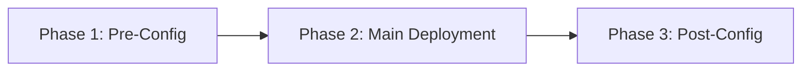

# GitOps Applications Reference

This document provides a comprehensive reference for all ArgoCD applications managed by the platform, including deployment phases, sync waves, overlays, and Helm chart details.

## ArgoCD Architecture

The platform uses ArgoCD as the GitOps engine. All applications are defined as ArgoCD `Application` custom resources and are organized into:

- **`gitops/argo-apps/base/`** — ArgoCD Application manifests
- **`gitops/applications/base/`** — Kubernetes resources (Helm, Kustomize)
- **`gitops/applications/overlays/`** — Environment-specific customizations

### Application Configuration Management Plugin (CMP)

ArgoCD uses a custom Config Management Plugin for variable substitution:

- **envsubst** — Replaces `${ARGOCD_ENV_*}` variables in manifests
- **helmfile** — Manages complex Helm deployments
- **helm** — Standard Helm chart rendering

All manifests use `${ARGOCD_ENV_*}` environment variables for parameterization, enabling the same base manifests to work across environments.

---

## Three-Phase Deployment Model

Applications follow a lifecycle with three phases, enforced through ArgoCD sync waves:



| Phase | Purpose | Naming Convention |
|-------|---------|-------------------|
| **Pre-Config** | Provision prerequisites: namespaces, CRDs, object storage, certificates | `*-pre.yaml` |
| **Main** | Deploy the core application via Helm charts or Kustomize | `*.yaml` |
| **Post-Config** | Configure integrations, seed data, create connections, deploy dashboards | `*-post-config.yaml` |

---

## Complete Application Inventory

### Infrastructure & Operators

| Application | Namespace | Helm Chart | Purpose |
|-------------|-----------|-----------|---------|
| **argocd-helm** | `argocd` | Custom CMP | ArgoCD with envsubst, helmfile, helm plugins |
| **capi-operator** | `capi-system` | — | Cluster API infrastructure provider operator |
| **capi** | `capi-system` | — | Cluster API cluster provisioning (cloud-specific overlay) |
| **capi-post-config** | `capi-system` | — | CAPI post-deployment Crossplane/Helm setup |
| **base-monitoring** | `monitoring` | — | Prometheus and Grafana Operator CRDs |

### Storage & Backup

| Application | Namespace | Helm Chart | Purpose |
|-------------|-----------|-----------|---------|
| **storage** | `kube-system` | Cloud-specific | Storage provisioning (EBS CSI / OpenEBS / Rook-Ceph) |
| **storage-post-config** | Various | — | Storage class configuration |
| **sc-storage** | `storage` | — | Storage cluster ArgoCD instance |
| **sc-storage-post-config** | `storage` | — | Storage cluster configuration |
| **openebs** | `openebs` | OpenEBS | In-cluster persistent storage (private cloud) |
| **velero-pre** | `velero` | — | Velero prerequisites (object storage setup) |
| **velero** | `velero` | Velero (VMware Tanzu) | Cluster backup and restore |
| **velero-post-config** | `velero` | — | Backup schedules and policies |
| **sc-velero** | `velero` | — | Storage cluster Velero |
| **sc-velero-post-config** | `velero` | — | Storage cluster Velero config |

### Service Mesh & Networking

| Application | Namespace | Helm Chart | Purpose |
|-------------|-----------|-----------|---------|
| **istio** | `istio-system` | `base`, `istiod`, `cni`, `ztunnel` | Istio service mesh with ambient mode |
| **istio-gw** | `istio-system` | — | Istio Gateway and VirtualService resources |
| **kiali** | `istio-system` | Kiali | Service mesh observability dashboard |
| **metallb** | `metallb-system` | MetalLB | Bare-metal load balancer (private cloud) |
| **hostport-allocator** | Various | — | HostPort resource allocation CRDs |
| **dns-utils-pre** | Various | — | DNS infrastructure prerequisites |
| **dns-utils** | Various | — | DNS utilities and External DNS |
| **dns-utils-post-config** | Various | — | DNS record configuration |

### Security & Identity

| Application | Namespace | Helm Chart | Purpose |
|-------------|-----------|-----------|---------|
| **cert-manager** | `cert-manager` | Cert-Manager | TLS certificate lifecycle management |
| **external-secrets** | Various | ESO | Syncs secrets from external providers to K8s |
| **kyverno** | `kyverno` | Kyverno | Kubernetes policy engine and admission controller |
| **vault** | `vault` | HashiCorp Vault + Vault Config Operator | Secrets management and PKI |
| **vault-post-config** | `vault` | — | Vault auth backends, policies, secrets |
| **zitadel-pre** | Various | — | Zitadel OIDC prerequisites |
| **zitadel** | Various | Zitadel | Identity provider and OIDC server |
| **zitadel-post-config** | Various | — | Zitadel organization and project setup |
| **netbird-pre** | Various | — | NetBird VPN prerequisites |
| **netbird** | Various | — | NetBird management server |
| **netbird-operator** | Various | NetBird K8s Operator | NetBird Kubernetes integration |
| **netbird-post-config** | Various | — | NetBird network configuration |

### Monitoring & Observability

| Application | Namespace | Helm Chart | Purpose |
|-------------|-----------|-----------|---------|
| **monitoring-pre** | `monitoring` | — | Object storage for Mimir/Loki backends |
| **monitoring** | `monitoring` | Multiple (see below) | Core monitoring stack |
| **monitoring-post-config** | `monitoring` | — | Dashboards, alerts, recording rules |
| **sc-monitoring** | `monitoring` | — | Storage cluster monitoring |

**Monitoring Stack Helm Charts:**

| Component | Chart Repository | Chart Name | Purpose |
|-----------|-----------------|-----------|---------|
| Mimir | `grafana.github.io` | `mimir-distributed` | Long-term metrics storage |
| Prometheus | `prometheus-community.github.io` | `kube-prometheus-stack` | Metrics collection and alerting |
| Loki | `grafana.github.io` | `loki` | Log aggregation |
| Tempo | `grafana.github.io` | `tempo-distributed` | Distributed tracing |
| Alloy | `grafana.github.io` | `alloy` | Metrics/log collection agent |
| Tempo Vulture | `grafana.github.io` | `tempo-vulture` | Trace test data generator |

### Artifact & Configuration Repositories

| Application | Namespace | Helm Chart | Purpose |
|-------------|-----------|-----------|---------|
| **nexus-pre** | `nexus` | — | Nexus prerequisites |
| **nexus** | `nexus` | Nexus3 (`stevehipwell`) | OCI, Maven, Helm proxy repository |
| **nexus-post-config** | `nexus` | — | Repository and user configuration |
| **harbor-pre** | `harbor` | — | Harbor prerequisites |
| **harbor** | `harbor` | Harbor (`goharbor.io`) | Container image registry |
| **harbor-post-config** | `harbor` | — | Project and replication configuration |
| **gitlab-pre** | `gitlab` | — | GitLab prerequisites |
| **gitlab** | `gitlab` | GitLab (`charts.gitlab.io`) | Source code management and CI/CD |
| **gitlab-post-config** | `gitlab` | — | GitLab initialization and configuration |

### Crossplane Infrastructure-as-Code

| Application | Namespace | Purpose |
|-------------|-----------|---------|
| **crossplane** | `crossplane-system` | Crossplane control plane |
| **crossplane-providers** | `crossplane-system` | Cloud provider configurations (AWS, K8s, SQL, Helm, Terraform) |
| **crossplane-packages** | `crossplane-system` | Crossplane composition packages |
| **crossplane-functions** | `crossplane-system` | Crossplane composition functions |
| **xplane-provider-config** | Various | Database provider configuration |

### Environment Deployment

| Application | Namespace | Purpose |
|-------------|-----------|---------|
| **deploy-env** | `deploy-env` | Environment provisioning using Crossplane/Terraform |
| **deploy-env-onboard** | `deploy-env` | Environment onboarding configuration |

### Utilities

| Application | Namespace | Purpose |
|-------------|-----------|---------|
| **reflector** | Various | Mirrors Secrets/ConfigMaps across namespaces |
| **reloader** | Various | Restarts pods on ConfigMap/Secret changes |
| **k8s-post-config** | Various | Cluster-level post-deployment setup |
| **sc-argocd** | `argocd` | Storage cluster ArgoCD instance |
| **redis-operator** | Various | Redis Operator for managed Redis instances |
| **percona-operator** | Various | Percona XtraDB Cluster operator for MySQL |

---

## Overlay System

### Cloud Provider Overlays (`overlays/cloud_provider/`)

| Provider | Components |
|----------|------------|
| **aws** | Crossplane provider config, Route53 DNS, EBS storage, CAPI operator, Vault AWS integration |
| **private-cloud** | Proxmox CAPI, MetalLB, OpenEBS/Ceph storage |

### Kubernetes Provider Overlays (`overlays/k8s_provider/`)

| Provider | Components |
|----------|------------|
| **eks** | EKS OIDC with Crossplane Terraform provider |
| **microk8s** | MicroK8s-specific configurations |

### Database Provider Overlays

| Category | Provider | Components |
|----------|----------|------------|
| **RDBMS** | `rds` | AWS RDS cluster, secrets, onboarding |
| **RDBMS** | `in-cluster` | Percona XtraDB Cluster, onboarding |
| **RDBMS** | `dbaas` | Database-as-a-Service, onboarding |
| **MongoDB** | `dbaas` | MongoDB Atlas or equivalent |

### ArgoCD Deployment Overlays (`argo-apps/overlays/local/`)

Pre-built overlay sets for different deployment scenarios:

| Overlay | Resources | Use Case |
|---------|-----------|----------|
| **root** | ~79 resources | Full platform deployment (all components) |
| **storage-cluster** | ~18 resources | Storage-only cluster (MetalLB, OpenEBS, Percona) |
| **vault** | Vault only | Standalone Vault deployment |
| **dns-utils** | DNS only | DNS utilities deployment |
| **security** | Zitadel | Identity provider deployment |
| **nexus** | Nexus | Artifact repository deployment |
| **gitlab** | GitLab | Source code management deployment |
| **maintenance** | Maintenance tasks | Cluster maintenance operations |

---

## Helm Chart Repository Reference

| Repository URL | Charts Used |
|----------------|------------|
| `https://istio-release.storage.googleapis.com/charts` | base, istiod, cni, ztunnel |
| `https://helm.releases.hashicorp.com` | vault |
| `https://redhat-cop.github.io/vault-config-operator` | vault-config-operator |
| `https://grafana.github.io/helm-charts` | mimir-distributed, loki, tempo-distributed, alloy, tempo-vulture |
| `https://prometheus-community.github.io/helm-charts` | kube-prometheus-stack |
| `https://charts.gitlab.io/` | gitlab |
| `https://helm.goharbor.io` | harbor |
| `https://stevehipwell.github.io/helm-charts/` | nexus3 |
| `https://vmware-tanzu.github.io/helm-charts/` | velero |
| `https://netbirdio.github.io/helms` | kubernetes-operator |
| `https://kubernetes-sigs.github.io/aws-ebs-csi-driver` | aws-ebs-csi-driver |

---

## Namespace Reference

| Namespace | Components |
|-----------|------------|
| `istio-system` | Istio, Kiali |
| `vault` | Vault, Vault Config Operator |
| `monitoring` | Prometheus, Grafana, Loki, Tempo, Mimir, Alloy |
| `argocd` | ArgoCD |
| `cert-manager` | Cert-Manager |
| `crossplane-system` | Crossplane, providers, functions |
| `velero` | Velero backup |
| `harbor` | Harbor registry |
| `gitlab` | GitLab |
| `nexus` | Nexus repository |
| `kyverno` | Kyverno policy engine |
| `mojaloop` | Mojaloop Hub services |
| `pm4ml-*` | PM4ML instances (per-DFSP namespace) |
| `deploy-env` | Environment provisioning |
| `keycloak` | Keycloak OIDC provider |

---

## Adding a New Application

To add a new ArgoCD-managed application:

### 1. Create Base Application Resources

```
gitops/applications/base/my-app/
├── kustomization.yaml
├── helm-release.yaml      # or deployment.yaml, etc.
└── namespace.yaml
```

### 2. Create ArgoCD Application Manifest

```yaml
# gitops/argo-apps/base/my-app.yaml
apiVersion: argoproj.io/v1alpha1
kind: Application
metadata:
  name: my-app
  namespace: argocd
  annotations:
    argocd.argoproj.io/sync-wave: "5"
spec:
  project: default
  source:
    repoURL: ${ARGOCD_ENV_repo_url}
    targetRevision: ${ARGOCD_ENV_target_revision}
    path: gitops/applications/base/my-app
    plugin:
      name: envsubst
  destination:
    server: https://kubernetes.default.svc
    namespace: ${ARGOCD_ENV_my_app_namespace}
  syncPolicy:
    automated:
      prune: true
      selfHeal: true
```

### 3. Add to Overlay Kustomization

```yaml
# gitops/argo-apps/overlays/local/root/kustomization.yaml
resources:
  - ../../../base/my-app.yaml
```

### 4. Add Terraform Configuration

Create `terraform/gitops/k8s-cluster-config/my-app.tf` to generate configuration:

```hcl
module "my_app" {
  source = "../generate-files"
  var_map = {
    my_app_setting = var.my_app_setting
  }
  generate_dir = "${var.output_dir}/my-app"
}
```

### 5. Create Templates

```
terraform/gitops/generate-files/templates/my-app/
└── install/
    └── kustomization.yaml.tpl
```

## Next Steps

- [Terraform Modules Reference](./terraform-modules.md) — Module inputs and outputs
- [Operations Guide](./operations-guide.md) — Managing applications post-deployment
- [Monitoring & Observability](./monitoring-and-observability.md) — Dashboard and alert setup
