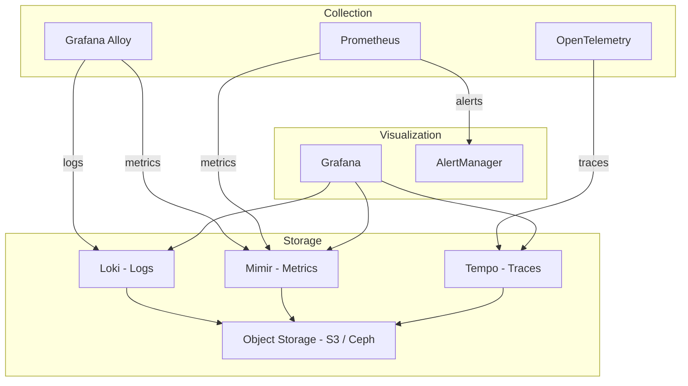

# Monitoring and Observability

This guide covers the complete monitoring, logging, tracing, and alerting stack deployed by the Mojaloop IaC Modules platform.

## Stack Overview

The observability stack is built on the Grafana ecosystem:



| Component | Version | Purpose |
|-----------|---------|---------|
| **Prometheus** | kube-prometheus-stack | Metrics collection, recording rules, alerting |
| **Grafana** | 12.1.0 | Dashboards, visualization, exploration |
| **Loki** | 6.45.2 | Log aggregation and querying |
| **Tempo** | Distributed mode | Distributed tracing backend |
| **Mimir** | Distributed mode | Long-term metrics storage |
| **Alloy** | Latest | Unified telemetry collection agent |
| **AlertManager** | Bundled with Prometheus | Alert routing and notification |
| **Grafana Operator** | 5.20.0 | Declarative Grafana resource management |

---

## Deployment Phases

The monitoring stack deploys in three phases:

### Phase 1: Pre-Config (`monitoring-pre`)

- Creates object storage buckets (S3 or Ceph) for:
  - Mimir blocks, alertmanager, and ruler storage
  - Loki chunks and index storage
  - Tempo trace storage
- Sets up namespaces and service accounts

### Phase 2: Main Deployment (`monitoring`)

Deploys via multiple Helm charts:
- **kube-prometheus-stack** — Prometheus, AlertManager, Grafana, node-exporter, kube-state-metrics
- **mimir-distributed** — Scalable metrics backend
- **loki** — Scalable log backend
- **tempo-distributed** — Scalable trace backend
- **alloy** — Collection agent
- **tempo-vulture** — Trace test data generator (optional)

### Phase 3: Post-Config (`monitoring-post-config`)

- Deploys Grafana dashboards via GrafanaDashboard CRDs
- Configures Prometheus recording rules
- Sets up alerting rules
- Deploys ServiceMonitor resources for application monitoring

---

## Configuration Reference

### Metrics (Prometheus / Mimir)

```yaml
# common-vars.yaml
prometheus_pvc_size: "50Gi"          # Prometheus local storage
prometheus_retention_days: 10         # Local retention period
prometheus_scrape_interval: "5m"      # Default scrape interval
mimir_enabled: true                   # Enable Mimir for long-term storage
monitoring_workload_class: monitoring # Node selector for monitoring pods
```

### Logs (Loki)

```yaml
# common-vars.yaml
loki_chart_version: "6.45.2"
loki_retention_hours: 72             # Log retention (3 days)
```

Loki is deployed in **distributed mode** with separate read and write paths for scalability. Log data is stored in S3-compatible object storage.

### Traces (Tempo)

```yaml
# common-vars.yaml
tempo_retention_hours: 72            # Trace retention (3 days)
opentelemetry_enabled: false         # Enable OpenTelemetry instrumentation
```

> See [Tracing Documentation](./tracing.md) for OpenTelemetry setup details.

### Grafana

```yaml
# common-vars.yaml
grafana_version: "12.1.0"
grafana_operator_version: "5.20.0"
```

---

## Pre-Built Dashboards

The platform ships with 20+ pre-built Grafana dashboards in `assets/grafana-dashboards/`:

### Infrastructure Dashboards

| Dashboard | File | Description |
|-----------|------|-------------|
| **Kubernetes Capacity Planning** | `kubernetes-capacity-planning.json` | Cluster resource usage and capacity forecasting |
| **HAProxy** | `haproxy.json` | HAProxy load balancer metrics |
| **Deployment Report** | `deployment-report.json` | Deployment status and history |

### Storage Dashboards

| Dashboard | File | Description |
|-----------|------|-------------|
| **Storage Quick View** | `storage-quick-view.json` | Storage utilization overview |
| **Storage Cost** | `storage-cost.json` | Storage cost estimation |
| **Ceph Object Store** | `ceph-objectstore.json` | Ceph object storage metrics |
| **Database Cost** | `db-cost-estimation.json` | Database resource cost estimation |

### Application Dashboards

| Dashboard | File | Description |
|-----------|------|-------------|
| **Istio ML Requests Monitor** | `istio-ml-requests-monitor.json` | Mojaloop service mesh traffic |
| **Mojaloop Connector** | `mojaloop-connector.json` | PM4ML connector metrics |
| **Soak Test** | `soak.json` | Long-running performance test results |

### Observability Dashboards

| Dashboard | File | Description |
|-----------|------|-------------|
| **Loki Metrics** | `loki-metrics.json` | Loki ingestion and query metrics |
| **Loki Log Statistics** | `loki-log-statistics.json` | Log volume and distribution |
| **Loki Storage** | `loki-storage.json` | Loki storage backend metrics |
| **Remote Write Resources** | `remote-write-resources-overview.json` | Prometheus remote write performance |

### Database Dashboards

| Dashboard | File | Description |
|-----------|------|-------------|
| **MySQL Exporter** | `mysql-exporter.json` | MySQL performance and query metrics |

### Networking Dashboards

| Dashboard | File | Description |
|-----------|------|-------------|
| **Network Traffic Analyzer** | `network-traffic-analyser.json` | Cluster network traffic |
| **Networking Cost** | `networking-cost-estimation.json` | Network cost estimation |
| **NetBird** | `netbird/*.json` | VPN tunnel metrics |

### Cloud Provider Dashboards

| Dashboard | File | Description |
|-----------|------|-------------|
| **AWS CloudWatch** | `aws-cloudwatch.json` | AWS service metrics via CloudWatch |

---

## AWS CloudWatch Integration

For AWS deployments, CloudWatch metrics are integrated into Prometheus using the YACE (Yet Another CloudWatch Exporter):

```yaml
# Enable CloudWatch exporter in custom-config
cloudwatch_exporter_enabled: true
```

**Architecture:**

```
AWS CloudWatch → YACE Exporter → Prometheus → Mimir → Grafana
```

YACE uses IRSA (IAM Roles for Service Accounts) for authentication, requiring no static credentials.

**Available CloudWatch Metrics:**
- EKS cluster metrics
- RDS database metrics (if using managed databases)
- S3 bucket metrics
- ALB/NLB metrics

> See [CloudWatch Integration](./monitoring/cloudwatch-integration.md) for detailed setup.

---

## Database Monitoring

### Self-Managed Databases (In-Cluster)

For Percona XtraDB or Helm-deployed MySQL:

```
MySQL Instance → MySQL Exporter (sidecar) → Prometheus → Grafana
```

ServiceMonitor resources are automatically created for each database instance.

### AWS RDS Databases

```
RDS Instance → CloudWatch → YACE Exporter → Prometheus → Grafana
               → Enhanced Monitoring → CloudWatch Logs → YACE
```

> See [Database Metrics](./monitoring/database-metrics.md) for detailed configuration.

---

## Alerting

### AlertManager Configuration

AlertManager is deployed as part of kube-prometheus-stack and handles alert routing:

```bash
# Access AlertManager UI
kubectl port-forward svc/alertmanager-main -n monitoring 9093:9093
```

### Default Alert Rules

The platform includes Prometheus alerting rules for:

| Category | Examples |
|----------|---------|
| **Node** | NodeNotReady, NodeMemoryPressure, NodeDiskPressure |
| **Pod** | PodCrashLooping, PodNotReady, ContainerOOMKilled |
| **Storage** | PersistentVolumeNearFull, StorageClassMissing |
| **Networking** | ServiceDown, IngressErrors |
| **Certificates** | CertificateExpiringSoon, CertificateRenewalFailed |

### Custom Alert Rules

Add custom alerting rules via Prometheus recording/alerting rules:

```yaml
# In custom-config or via monitoring-post-config
apiVersion: monitoring.coreos.com/v1
kind: PrometheusRule
metadata:
  name: mojaloop-alerts
  namespace: monitoring
spec:
  groups:
    - name: mojaloop.rules
      rules:
        - alert: MojaloopTransferLatencyHigh
          expr: histogram_quantile(0.99, rate(mojaloop_transfer_duration_seconds_bucket[5m])) > 30
          for: 10m
          labels:
            severity: warning
          annotations:
            summary: "Mojaloop transfer latency is high (p99 > 30s)"
```

---

## Monitoring Mixin

The `monitoring-mixin/` directory contains Jsonnet-based monitoring configurations:

### Building Monitoring Mixins

```bash
cd monitoring-mixin

# Install Jsonnet dependencies
jb install

# Build monitoring configurations
bash build.sh
```

### Mixin Components

| File | Purpose |
|------|---------|
| `main.jsonnet` | Entry point merging all mixin sources |
| `mimir.libsonnet` | Grafana Mimir recording rules and dashboards |
| `aws.libsonnet` | AWS CloudWatch exporter configuration |

### Output

The build process generates:
- Grafana dashboard JSON files
- Prometheus recording rules
- Prometheus alerting rules

---

## Process Exporter (Optional)

For detailed process-level metrics:

```yaml
# common-vars.yaml
process_exporter_enabled: true
```

This deploys `process-exporter` as a DaemonSet to collect per-process CPU, memory, and I/O metrics.

---

## Grafana Access

### Default Access

```bash
# Port-forward Grafana
kubectl port-forward svc/grafana -n monitoring 3000:3000
```

Or access via the configured ingress at `https://grafana.<domain>`.

### Data Sources

Grafana is pre-configured with the following data sources:

| Source | Type | Purpose |
|--------|------|---------|
| Prometheus | Metrics | Real-time metrics queries |
| Mimir | Metrics | Long-term metrics queries |
| Loki | Logs | Log exploration and queries |
| Tempo | Traces | Distributed trace exploration |

### Exploring Logs (Loki)

In Grafana, navigate to **Explore** → Select **Loki** data source:

```logql
# View all logs from a namespace
{namespace="mojaloop"}

# Filter by pod name
{namespace="mojaloop", pod=~"central-ledger.*"}

# Search for errors
{namespace="mojaloop"} |= "error"

# JSON structured logging
{namespace="mojaloop"} | json | level="error"
```

### Exploring Traces (Tempo)

In Grafana, navigate to **Explore** → Select **Tempo** data source:

- Search by **Trace ID**
- Search by **Service Name**
- Search by **Duration** (find slow requests)
- Search by **Status** (find errors)

> OpenTelemetry must be enabled. See [Tracing](./tracing.md) for details.

---

## Capacity Planning

### Monitoring Storage Requirements

| Component | Storage Type | Typical Size (per day) |
|-----------|-------------|----------------------|
| Prometheus | PVC (local) | 5-10 GB |
| Mimir | Object Storage (S3) | 2-5 GB |
| Loki | Object Storage (S3) | 1-5 GB |
| Tempo | Object Storage (S3) | 0.5-2 GB |

### Resource Requirements

| Component | CPU Request | Memory Request |
|-----------|------------|----------------|
| Prometheus | 500m | 2Gi |
| Grafana | 200m | 512Mi |
| Loki (read) | 500m | 1Gi |
| Loki (write) | 500m | 1Gi |
| Mimir (ingester) | 500m | 2Gi |
| Alloy | 200m | 256Mi |

---

## Troubleshooting Monitoring

### Prometheus Not Scraping Targets

```bash
# Check Prometheus targets
kubectl port-forward svc/prometheus -n monitoring 9090:9090
# Navigate to Status → Targets

# Check ServiceMonitor resources
kubectl get servicemonitors -A
```

### Loki Not Receiving Logs

```bash
# Check Alloy pods
kubectl get pods -n monitoring -l app.kubernetes.io/name=alloy

# Check Alloy logs
kubectl logs -n monitoring -l app.kubernetes.io/name=alloy --tail=50
```

### Grafana Dashboard Not Loading

```bash
# Check GrafanaDashboard CRDs
kubectl get grafanadashboards -A

# Check Grafana Operator logs
kubectl logs -n monitoring -l app.kubernetes.io/name=grafana-operator --tail=50
```

## Next Steps

- [Security Architecture](./security-architecture.md) — Security monitoring integration
- [Operations Guide](./operations-guide.md) — Alert response procedures
- [Troubleshooting](./troubleshooting.md) — Monitoring-specific issues
