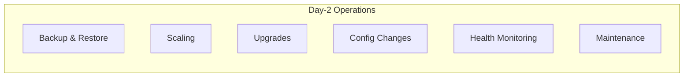

# Operations Guide

This guide covers day-2 operations for managing Mojaloop IaC Modules deployments, including backup and restore, scaling, upgrades, configuration changes, and routine maintenance.

## Operational Overview



---

## Backup and Restore

### Velero Backup

Velero provides cluster-level backup and restore using S3-compatible object storage.

#### Scheduled Backups

Backup schedules are configured during deployment via `velero-post-config`:

```yaml
# Configured in platform-stateful-resources.yaml
backup:
  enabled: true
  schedule: "0 2 * * *"      # Daily at 2:00 AM UTC
  retention: 7                # Keep 7 daily backups
```

#### Manual Backup

```bash
# Create a backup of all namespaces
velero backup create full-backup-$(date +%Y%m%d)

# Backup a specific namespace
velero backup create mojaloop-backup \
  --include-namespaces mojaloop

# Check backup status
velero backup describe full-backup-20240101

# List all backups
velero backup get
```

#### Restore from Backup

```bash
# Restore entire backup
velero restore create --from-backup full-backup-20240101

# Restore specific namespace
velero restore create --from-backup full-backup-20240101 \
  --include-namespaces mojaloop

# Check restore status
velero restore describe <restore-name>
```

### Database Backups

#### MySQL (Percona XtraDB / RDS)

For in-cluster Percona deployments:

```bash
# Check Percona backup status
kubectl get perconaxtradbclusterbackup -n mojaloop

# Trigger manual backup
kubectl apply -f - <<EOF
apiVersion: pxc.percona.com/v1
kind: PerconaXtraDBClusterBackup
metadata:
  name: manual-backup-$(date +%Y%m%d)
  namespace: mojaloop
spec:
  pxcCluster: central-ledger-db
  storageName: s3-backup
EOF
```

For AWS RDS instances, backups are managed through AWS automated snapshots configured via Terraform.

### Control Center Backups (AWS)

GitLab server snapshots are managed by AWS DLM:

```bash
# Check DLM lifecycle policy
aws dlm get-lifecycle-policies

# Manual EBS snapshot
aws ec2 create-snapshot \
  --volume-id <gitlab-volume-id> \
  --description "Manual GitLab backup $(date)"
```

---

## Scaling

### Horizontal Node Scaling

#### AWS EKS

Modify node group sizes in `custom-config/cluster-config.yaml`:

```yaml
nodes:
  agent:
    mojaloop-workload:
      node_count: 5    # Increase from 3 to 5
```

Apply the change:

```bash
cd terraform/k8s/k8s-deploy
terragrunt apply
```

#### MicroK8s (Private Cloud)

Add new nodes by updating the cluster configuration and running Ansible:

```yaml
nodes:
  agent:
    worker-3:
      ip_address: 192.168.1.22
    worker-4:
      ip_address: 192.168.1.23
```

```bash
cd terraform/k8s/ansible-k8s-deploy
terragrunt apply
```

### Vertical Scaling

Change instance types in `cluster-config.yaml`:

```yaml
nodes:
  agent:
    mojaloop-workload:
      instance_type: m5.8xlarge   # Upgrade from m5.4xlarge
```

> **Note**: Vertical scaling of EKS node groups requires a rolling update, which will drain and replace nodes.

### Application Scaling

Mojaloop services can be scaled via Helm value overrides:

```yaml
# custom-config/mojaloop-values-override.yaml
central-ledger:
  replicaCount: 3

ml-api-adapter:
  replicaCount: 3

quoting-service:
  replicaCount: 2
```

Apply:

```bash
cd terraform/k8s/gitops-build
terragrunt apply
# ArgoCD will sync the changes automatically
```

---

## Upgrades

### Platform Component Upgrades

#### Upgrading Helm Chart Versions

Update chart versions in `custom-config/common-vars.yaml`:

```yaml
# Example: Upgrade monitoring stack
grafana_version: "12.2.0"
loki_chart_version: "6.50.0"
```

#### Upgrading Kubernetes Version

Update in `custom-config/cluster-config.yaml`:

```yaml
kubernetes_version: "1.33"
```

For EKS:

```bash
cd terraform/k8s/k8s-deploy
terragrunt plan   # Review changes
terragrunt apply  # Apply upgrade
```

> **Warning**: Always upgrade one minor version at a time (e.g., 1.31 → 1.32 → 1.33).

#### Upgrading Mojaloop

Update the Mojaloop chart version:

```yaml
# custom-config/mojaloop-vars.yaml
mojaloop_chart_version: "16.0.0"
```

```bash
cd terraform/k8s/gitops-build
terragrunt apply
```

### Upgrade Workflow

1. **Review release notes** for breaking changes
2. **Backup** the cluster using Velero
3. **Test in staging** environment first
4. **Update configuration** files
5. **Plan** changes with `terragrunt plan`
6. **Apply** changes with `terragrunt apply`
7. **Monitor** ArgoCD sync and pod health
8. **Verify** application functionality

---

## Configuration Changes

### Applying Configuration Changes

The standard workflow for any configuration change:

```bash
# 1. Edit custom configuration
vi custom-config/<config-file>.yaml

# 2. Merge configurations (if using profiles)
cd terraform/ccnew
bash scripts/mergeconfigs.sh

# 3. Rebuild GitOps configuration
cd terraform/k8s/gitops-build
terragrunt apply

# 4. ArgoCD automatically syncs changes to the cluster
```

### Common Configuration Changes

#### Enable a Feature

```yaml
# custom-config/mojaloop-vars.yaml
bulk_enabled: true
```

#### Add a New PM4ML Instance

```yaml
# custom-config/pm4ml-vars.yaml
pm4mls:
  new-dfsp:
    dfsp_id: "NEWDFSP"
    domain: "newdfsp.example.com"
    currencies: ["USD"]
```

#### Change Resource Limits

```yaml
# custom-config/mojaloop-values-override.yaml
central-ledger:
  resources:
    requests:
      cpu: "500m"
      memory: "512Mi"
    limits:
      cpu: "2000m"
      memory: "2Gi"
```

#### Modify RBAC Permissions

Edit `mojaloop-rbac-permissions.yaml` or `pm4ml-rbac-permissions.yaml`:

```yaml
roles:
  - name: custom-role
    permissions:
      - transfers.view
      - settlements.view
```

---

## Health Monitoring

### Cluster Health

```bash
# Node status
kubectl get nodes -o wide

# All pods across namespaces
kubectl get pods -A --field-selector=status.phase!=Running

# ArgoCD application health
kubectl get applications -n argocd

# Resource usage
kubectl top nodes
kubectl top pods -A --sort-by=memory
```

### Mojaloop Service Health

```bash
# Check Mojaloop pods
kubectl get pods -n mojaloop

# Service health endpoints
curl -s https://central-ledger.<domain>/health | jq
curl -s https://ml-api-adapter.<domain>/health | jq
curl -s https://account-lookup-service.<domain>/health | jq
```

### Vault Health

```bash
# Vault status
kubectl exec -n vault vault-0 -- vault status

# Vault seal status
kubectl exec -n vault vault-0 -- vault operator seal-status

# Check Vault pods
kubectl get pods -n vault
```

### Database Health

```bash
# MySQL (Percona) status
kubectl get pxc -A

# Redis status
kubectl get redisfailover -A

# Kafka status
kubectl get kafka -A
```

---

## Routine Maintenance

### Certificate Renewal

Cert-Manager automatically renews certificates. Monitor certificate status:

```bash
# List all certificates
kubectl get certificates -A

# Check certificate details
kubectl describe certificate <cert-name> -n <namespace>

# Force renewal
kubectl delete certificate <cert-name> -n <namespace>
# Cert-Manager will recreate it automatically
```

### Log Rotation and Retention

Loki manages log retention based on configuration:

```yaml
# Configured in common-vars.yaml
loki_retention_hours: 72    # 3-day retention
```

### Monitoring Alert Management

```bash
# View active alerts
kubectl port-forward svc/alertmanager -n monitoring 9093:9093
# Access at http://localhost:9093

# Silence an alert
# Use the AlertManager UI or API
```

### ArgoCD Application Sync

```bash
# Force sync all applications
argocd app sync --all

# Sync specific application
argocd app sync mojaloop

# Check sync status
argocd app list
```

---

## Disaster Recovery

### Full Cluster Recovery

1. **Provision new infrastructure**:
   ```bash
   cd terraform/k8s/k8s-deploy
   terragrunt apply
   ```

2. **Restore Vault** (critical first step):
   ```bash
   # Restore Vault from backup
   velero restore create --from-backup <backup-name> \
     --include-namespaces vault
   ```

3. **Restore applications**:
   ```bash
   cd terraform/k8s/gitops-build
   terragrunt apply
   # ArgoCD redeploys all applications
   ```

4. **Restore data**:
   ```bash
   # Restore database backups
   velero restore create --from-backup <backup-name> \
     --include-namespaces mojaloop
   ```

### Partial Recovery

For individual service failures:

```bash
# Delete and let ArgoCD recreate
kubectl delete pod <pod-name> -n <namespace>

# Force ArgoCD re-sync
argocd app sync <app-name> --force

# Rollback ArgoCD application
argocd app rollback <app-name>
```

---

## Terraform State Management

### Viewing State

```bash
# List state resources
cd terraform/k8s/gitops-build
terragrunt state list

# Show specific resource
terragrunt state show module.mojaloop
```

### State Recovery

If Terraform state is corrupted:

```bash
# Import existing resources
terragrunt import <resource-address> <resource-id>

# Remove orphaned state entries
terragrunt state rm <resource-address>
```

### State Backup

Terraform state is stored as Kubernetes secrets:

```bash
# List state secrets
kubectl get secrets -n terraform-state

# Backup state secret
kubectl get secret <state-secret> -n terraform-state -o yaml > state-backup.yaml
```

---

## Operational Runbooks

### Runbook: Vault Unsealing

If Vault becomes sealed:

```bash
# Check seal status
kubectl exec -n vault vault-0 -- vault status

# Unseal (requires unseal keys)
kubectl exec -n vault vault-0 -- vault operator unseal <key-1>
kubectl exec -n vault vault-0 -- vault operator unseal <key-2>
kubectl exec -n vault vault-0 -- vault operator unseal <key-3>
```

### Runbook: ArgoCD Application Stuck

```bash
# Check application status
argocd app get <app-name>

# Check for sync errors
argocd app sync <app-name> --dry-run

# Force refresh
argocd app get <app-name> --refresh

# Hard refresh (clear cache)
argocd app get <app-name> --hard-refresh
```

### Runbook: Node Not Ready

```bash
# Check node conditions
kubectl describe node <node-name>

# Check kubelet logs
journalctl -u kubelet -f  # On the node

# Drain and uncordon
kubectl drain <node-name> --ignore-daemonsets --delete-emptydir-data
kubectl uncordon <node-name>
```

## Next Steps

- [Monitoring & Observability](./monitoring-and-observability.md) — Set up dashboards and alerts
- [Security Architecture](./security-architecture.md) — Security operations
- [Troubleshooting](./troubleshooting.md) — Common issues and resolutions
