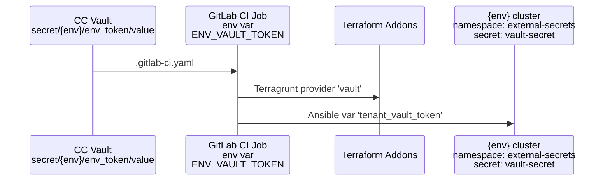

# Secrets

Mojaloop uses various secrets to implement security. This is documentation
describes which part of the system they protect, how their expiration is configured,
how they are propagated and how they are renewed.

## Vault access token

This secret allows the environments to access the tenancy vault.
It is also known as `env_token` or `ENV_VAULT_TOKEN` in various
places across the iac-modules.

### Security impact

This secret allows to secure the following functionality:

- Synchronization of secrets for:
  - Cert Manager
  - Crossplane
  - External DNS
  - Mojaloop report bucket
  - Monitoring
  - Netbird operator
  - OIDC
  - Velero
  - Storage
  - Stateful resources
- Addons:
  - The automated onboarding, which writes to the tenancy
    vault

### Configuring expiration

The default is in [common-vars.yaml](../terraform/ccnew/default-config/common-vars.yaml)
The expiration can be configured in:

```yaml
# custom-config/common-vars.yaml
env_token_ttl: "14d" # expiration time in days
```

### Propagation

This secret is stored in the tenancy vault in the CC cluster and propagates to
the GitLab pipeline jobs via `.gitlab-ci.yaml`.
Then it is used by

- Terraform addons: to allow addons to access the CC vault
- Ansible: to allow creation of a secret in the external-secrets namespace
  in the environment



### Renewal

Manual renewal can be achieved by following the steps:

1. step 1
1. step 2
...
