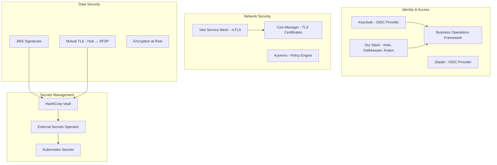
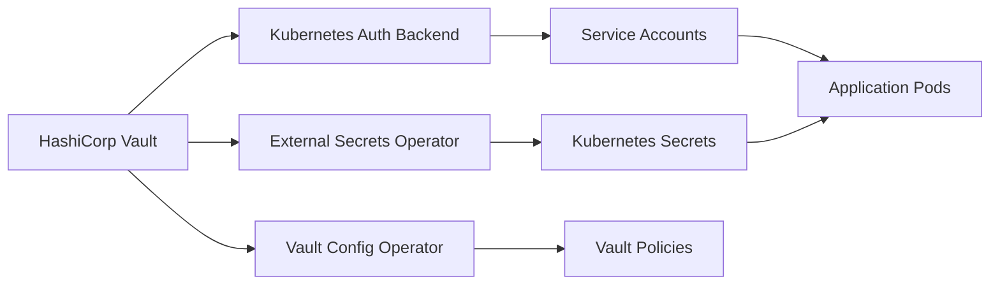
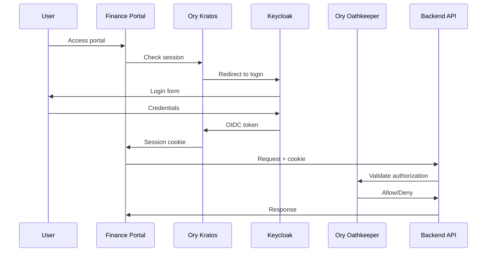

# Security Architecture

This document provides a comprehensive reference for the security model implemented by the Mojaloop IaC Modules platform, covering secrets management, network security, identity and access management, certificate management, and compliance controls.

## Security Overview



---

## Secrets Management (HashiCorp Vault)

### Architecture

Vault serves as the central secrets store for the entire platform:



### Vault Deployment

- Deployed via Helm chart in the `vault` namespace
- High availability mode with Raft storage backend
- Auto-unseal configured (via AWS KMS or transit)
- Kubernetes authentication backend enabled

### Secret Organization

```
vault/
├── secret/
│   ├── mojaloop/              # Mojaloop Hub secrets
│   │   ├── central-ledger/    # Database credentials
│   │   ├── kafka/             # Kafka authentication
│   │   ├── jws/               # JWS signing keys
│   │   └── tls/               # TLS certificates
│   ├── pm4ml/                 # PM4ML secrets (per DFSP)
│   │   ├── dfsp1/
│   │   └── dfsp2/
│   ├── platform/              # Platform service secrets
│   │   ├── grafana/
│   │   ├── keycloak/
│   │   └── argocd/
│   └── smtp-credentials       # SMTP configuration
├── pki/                       # Internal PKI
│   ├── mojaloop-ca/           # Mojaloop CA
│   └── dfsp-ca/               # DFSP certificate authority
└── transit/                   # Transit encryption keys
```

### External Secrets Operator (ESO)

ESO synchronizes secrets from Vault to Kubernetes:

```yaml
apiVersion: external-secrets.io/v1beta1
kind: ExternalSecret
metadata:
  name: db-credentials
  namespace: mojaloop
spec:
  refreshInterval: 1h
  secretStoreRef:
    kind: ClusterSecretStore
    name: vault-backend
  target:
    name: central-ledger-db-secret
  data:
    - secretKey: username
      remoteRef:
        key: secret/mojaloop/central-ledger
        property: username
    - secretKey: password
      remoteRef:
        key: secret/mojaloop/central-ledger
        property: password
```

### Vault Config Operator

The Vault Config Operator manages Vault configuration declaratively:
- Policies
- Auth backends
- Secret engines
- PKI certificate authorities

---

## Network Security

### Service Mesh (Istio mTLS)

All inter-service communication within the mesh is encrypted with mutual TLS:

```yaml
# Istio PeerAuthentication - enforces mTLS
apiVersion: security.istio.io/v1
kind: PeerAuthentication
metadata:
  name: default
  namespace: istio-system
spec:
  mtls:
    mode: STRICT    # All traffic must use mTLS
```

**Istio Security Features:**
- **mTLS** — Automatic certificate rotation and mutual authentication
- **Authorization Policies** — Fine-grained access control between services
- **Request Authentication** — JWT validation at the mesh level
- **Ambient Mode** — L4 mTLS with ztunnel (no sidecar injection required)

### Kyverno Policies

Kyverno enforces Kubernetes admission policies:

| Policy Category | Examples |
|----------------|---------|
| **Pod Security** | Disallow privileged containers, enforce read-only root filesystem |
| **Image Security** | Require images from trusted registries (Harbor) |
| **Network** | Enforce NetworkPolicy presence |
| **Labels** | Require standard labels on all resources |
| **Resource Limits** | Enforce CPU/memory limits on all containers |

### Ingress TLS

All external-facing services use TLS:

```yaml
# Cert-Manager Certificate
apiVersion: cert-manager.io/v1
kind: Certificate
metadata:
  name: wildcard-cert
spec:
  secretName: wildcard-tls
  issuerRef:
    name: letsencrypt-prod
    kind: ClusterIssuer
  dnsNames:
    - "*.example.com"
```

> See [Gateway TLS](./security/gateway-tls.md) for detailed TLS configuration.

---

## Identity and Access Management

### Authentication Flow



### Keycloak (OIDC Provider)

- **Purpose**: User management and OIDC token issuance
- **Deployment**: Operator-managed in `keycloak` namespace
- **Version**: 22.0.2
- **Security Hardening**:
  - `KC_COOKIE_SECURE=true`
  - `KC_COOKIE_SAME_SITE=strict`
  - Proxy headers configured for proper X-Forwarded-* forwarding

### Zitadel (Alternative OIDC)

When enabled, Zitadel replaces Keycloak as the OIDC provider:
- Deployed with three-phase lifecycle (pre, main, post-config)
- Organization and project configuration via post-config

### Ory Stack

| Component | Purpose |
|-----------|---------|
| **Ory Keto** | Role-based access control (RBAC) — owns roles and permissions |
| **Ory Oathkeeper** | API gateway — authenticates and authorizes API requests |
| **Ory Kratos** | Session management — login/logout flows using cookies |

### Role-Permission Operator

A Kubernetes operator that:
1. Watches Kubernetes Role custom resources
2. Syncs role-permission assignments to Ory Keto
3. Provides API for user-role assignment

### RBAC Configuration

Roles and permissions are defined in YAML files managed via GitOps:

```yaml
# mojaloop-rbac-permissions.yaml
roles:
  - name: operator
    permissions:
      - transfers.view
      - settlements.create
      - participants.view
  - name: manager
    permissions:
      - all
  - name: mcmadmin
    permissions:
      - mcm.admin
```

> See [Business Operations Framework](./BOF.md) for complete authentication/authorization documentation.

---

## Certificate Management

### Cert-Manager

Cert-Manager automates TLS certificate lifecycle:

| Feature | Configuration |
|---------|--------------|
| **Issuers** | Let's Encrypt (production/staging), Internal CA |
| **Certificate Types** | Wildcard, per-service, mTLS |
| **Renewal** | Automatic (30 days before expiry) |
| **Storage** | Kubernetes Secrets |

### Certificate Types

| Certificate | Purpose | Managed By |
|------------|---------|------------|
| **Gateway TLS** | External HTTPS endpoints | Cert-Manager |
| **Service mTLS** | Inter-service authentication | Istio |
| **Vault PKI** | Internal certificate authority | Vault |
| **JWS Keys** | Message signing (Hub ↔ DFSP) | Vault PKI |
| **DFSP mTLS** | Hub-to-DFSP mutual authentication | Vault PKI |

> See dedicated security docs:
> - [Gateway TLS](./security/gateway-tls.md)
> - [DFSP mTLS](./security/dfsp-mtls.md)
> - [DFSP JWS](./security/dfsp-jws.md)
> - [Hub JWS](./security/hub-jws.md)
> - [Object Storage TLS](./security/object-storage-tls.md)

---

## Mojaloop-Specific Security

### Interledger Protocol (ILP) Security

```yaml
# ILP Configuration
ILP_SECRET: "<vault-managed>"     # Shared secret for ILP conditions
ILP_VERSION: 4                     # ILP version (1 or 4)
CHECK_ILP: true                    # Enable ILP validation
```

> See [ILP Configuration](./ilp-config.md) for details.

### JWS (JSON Web Signature)

Digital signatures for Mojaloop API messages between Hub and DFSPs:

- **Hub JWS**: Hub signs outgoing messages, DFSPs verify
- **DFSP JWS**: DFSPs sign outgoing messages, Hub verifies
- Keys managed in Vault PKI

> See [Hub JWS](./security/hub-jws.md) and [DFSP JWS](./security/dfsp-jws.md).

### Mutual TLS (DFSP Connectivity)

Hub-to-DFSP connections use mutual TLS for bidirectional authentication:

```
Hub ←→ DFSP
  ├── Hub presents its TLS certificate
  ├── DFSP presents its TLS certificate
  ├── Both verify against trusted CA
  └── Encrypted channel established
```

> See [DFSP mTLS](./security/dfsp-mtls.md).

---

## VPN Security (NetBird)

NetBird provides secure remote access to cluster resources:

- **Management Server**: Deployed in-cluster
- **Kubernetes Operator**: Manages VPN tunnels declaratively
- **Authentication**: Integrated with Zitadel/Keycloak OIDC
- **Network Policies**: WireGuard-based encrypted tunnels

---

## Container Image Security

### Harbor Registry

When enabled, Harbor provides:
- **Image Scanning**: Trivy vulnerability scanner
- **Image Signing**: Cosign/Notary support
- **Replication**: Pull-through cache from upstream registries
- **Access Control**: Project-based RBAC

### Kyverno Image Policies

```yaml
# Enforce images from trusted registry
apiVersion: kyverno.io/v1
kind: ClusterPolicy
metadata:
  name: require-trusted-registry
spec:
  rules:
    - name: check-registry
      match:
        resources:
          kinds: ["Pod"]
      validate:
        message: "Images must come from the trusted Harbor registry"
        pattern:
          spec:
            containers:
              - image: "harbor.example.com/*"
```

---

## Vault Tokens and Authentication

### Kubernetes Auth Backend

Applications authenticate to Vault using Kubernetes service accounts:

```
Pod → Service Account Token → Vault K8s Auth → Vault Token → Secret Access
```

### Tenancy Vault Tokens

PM4ML deployments use scoped Vault tokens per DFSP:

```
PM4ML DFSP1 → Vault Token (scoped to secret/pm4ml/dfsp1/*) → DFSP1 secrets only
PM4ML DFSP2 → Vault Token (scoped to secret/pm4ml/dfsp2/*) → DFSP2 secrets only
```

> See [Tenancy Vault Token](./security/tenancy-vault-token.md) for details.

---

## Encryption

### At Rest

| Component | Encryption Method |
|-----------|------------------|
| **Kubernetes Secrets** | etcd encryption (provider-dependent) |
| **Vault Storage** | AES-256-GCM (Vault seal) |
| **EBS Volumes** | AWS EBS encryption (default) |
| **S3 Buckets** | SSE-S3 or SSE-KMS |
| **Database** | TDE (Transparent Data Encryption) where available |

### In Transit

| Connection | Encryption |
|-----------|-----------|
| **Service-to-Service** | Istio mTLS (automatic) |
| **External Ingress** | TLS 1.2+ (Cert-Manager) |
| **Hub ↔ DFSP** | Mutual TLS |
| **Vault Communication** | TLS |
| **Database Connections** | TLS (configurable) |

---

## Security Checklist

### Pre-Deployment

- [ ] Configure Vault auto-unseal (AWS KMS or transit)
- [ ] Generate and securely store Vault unseal keys
- [ ] Configure Cert-Manager issuer (Let's Encrypt or internal CA)
- [ ] Set SMTP credentials in Vault for MCM notifications
- [ ] Review and customize RBAC permissions
- [ ] Configure Keycloak realm and client settings

### Post-Deployment

- [ ] Verify Istio mTLS is enforced (`PeerAuthentication: STRICT`)
- [ ] Verify all certificates are valid and auto-renewing
- [ ] Test RBAC by accessing portals with different roles
- [ ] Verify Vault policies restrict access appropriately
- [ ] Check Kyverno policies are enforcing
- [ ] Verify External Secrets are syncing from Vault
- [ ] Test backup and restore procedures

### Ongoing Operations

- [ ] Monitor certificate expiration (Prometheus alerts)
- [ ] Rotate Vault tokens periodically
- [ ] Review and audit RBAC role assignments
- [ ] Keep Keycloak/Zitadel updated
- [ ] Review Kyverno policy violations
- [ ] Scan container images for vulnerabilities (Harbor/Trivy)

---

## Security-Related Documentation

| Document | Description |
|----------|-------------|
| [BOF](./BOF.md) | Business Operations Framework — full auth/authz reference |
| [Authentication](./security/authentication.md) | Authentication mechanisms |
| [Gateway TLS](./security/gateway-tls.md) | Ingress TLS configuration |
| [DFSP mTLS](./security/dfsp-mtls.md) | Hub-to-DFSP mutual TLS |
| [DFSP JWS](./security/dfsp-jws.md) | DFSP message signing |
| [Hub JWS](./security/hub-jws.md) | Hub message signing |
| [Object Storage TLS](./security/object-storage-tls.md) | Object storage TLS |
| [Tenancy Vault Token](./security/tenancy-vault-token.md) | Per-tenant Vault tokens |

## Next Steps

- [Operations Guide](./operations-guide.md) — Security operations procedures
- [Monitoring & Observability](./monitoring-and-observability.md) — Security monitoring
- [Troubleshooting](./troubleshooting.md) — Security-related issues
