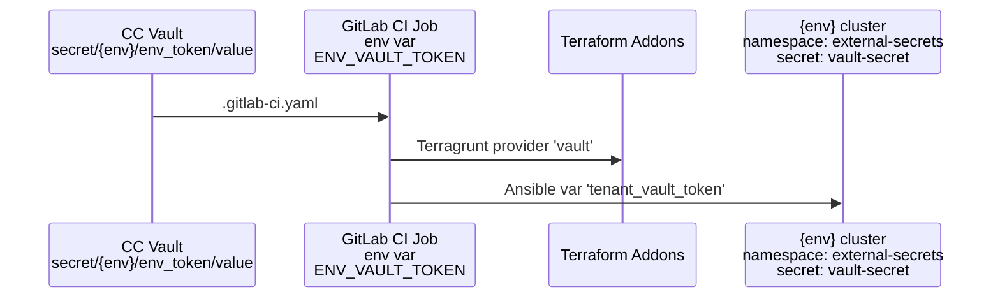

# Tenancy vault token

This secret allows the environments to access the tenancy vault.
It is also known as `env_token` or `ENV_VAULT_TOKEN` in various
places across the iac-modules.

## Security impact

This secret allows to secure the following functionality:

- Synchronization of secrets for:
  - Cert Manager
  - Crossplane
  - External DNS
  - Mojaloop report bucket
  - Monitoring
  - Netbird operator
  - OIDC
  - Velero
  - Storage
  - Stateful resources
- Addons:
  - The automated onboarding, which writes to the tenancy
    vault

## Configuring expiration

The default is in [common-vars.yaml](../terraform/ccnew/default-config/common-vars.yaml)
The expiration can be configured in:

```yaml
# custom-config/common-vars.yaml
env_token_ttl: "14d" # expiration time in days
```

## Propagation

This secret is stored in the tenancy vault in the CC cluster and propagates to
the GitLab pipeline jobs via `.gitlab-ci.yaml`.
Then it is used by

- Terraform addons: to allow addons to access the CC vault
- Ansible: to allow creation of a secret in the external-secrets namespace
  in the environment



## Renewal

Manual renewal can be achieved by following the steps:

1.
1.

Automatic renewal is implemented via this process:

1. A [Workspace](../../gitops/applications/base/deploy-env/env-config-xplane-terraform.yaml)
  named `envs-config` is created in the control center cluster.
1. This workspace uses a Crossplane `ProviderConfig` (defined in the same file above)
  to connect to the tenancy vault.
1. The workspace points to the Terraform module defined in the folder
  [deploy-env-config](../../terraform/config-params/ccnew-config/deploy-env-config)
1. The module maintains a `vault_token` resource named `env_token`, defined in
  [vault-transit.tf](../../terraform/config-params/ccnew-config/deploy-env-config/vault-transit.tf)
1. Each time the workspace is reconciled, Crossplane checks the expiry of the
   token in Vault.
1. If the token needs renewal, Crossplane triggers the recreation of the token and
   a commit to the environment for which the token is created.
1. The commit updates a file named `.vault_token_trigger` with a hash of the new
   token value and a message prefix `tf_trigger:`
1. This triggers the GitLab job `tf-refresh-deploy-infra` in the environment,
   which picks up the new token value and propagates it to the environment
   cluster as described in the "Propagation" section above.
