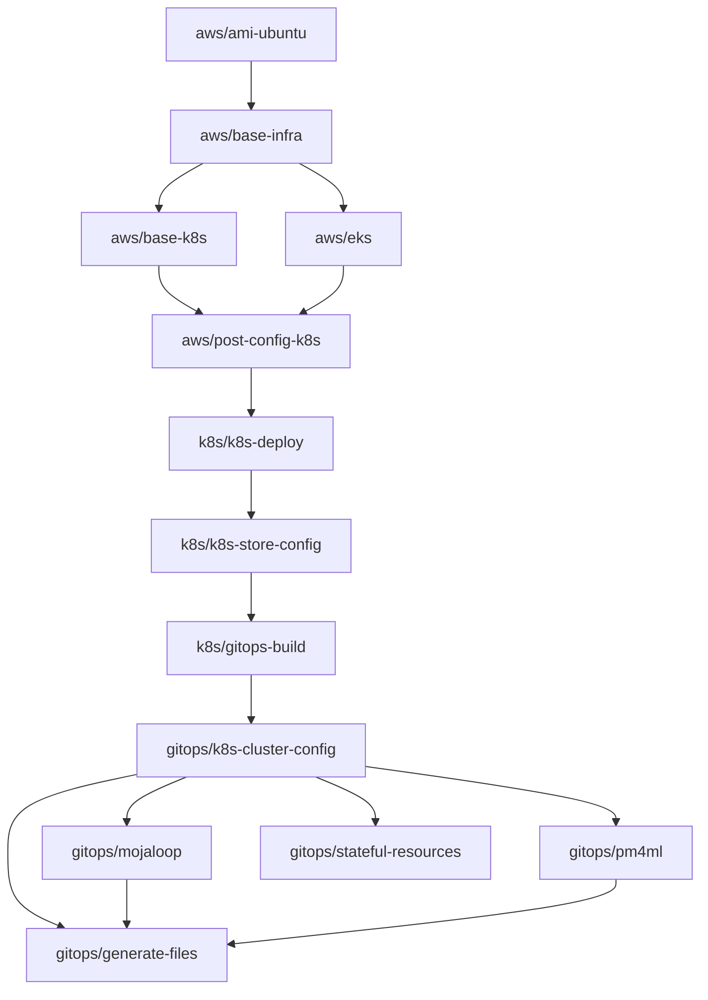

# Terraform Modules Reference

This document provides a comprehensive reference for all Terraform modules in the platform, including their purpose, inputs, outputs, and dependencies.

## Module Organization

```
terraform/
├── aws/                    # AWS cloud infrastructure modules
├── private-cloud/          # Private cloud/bare-metal modules
├── k8s/                    # Kubernetes cluster lifecycle modules
├── gitops/                 # GitOps manifest generation modules
├── ansible/                # Ansible integration modules
├── control-center/         # Control Center initialization
├── ccnew/                  # Control Center deployment orchestration
└── gitlab/                 # GitLab CI/CD templates
```

---

## AWS Modules (`terraform/aws/`)

### `ami-ubuntu`

Finds the latest Ubuntu AMI ID for EC2 instances.

| Input | Type | Description |
|-------|------|-------------|
| `most_recent` | `bool` | Use the most recent AMI |
| `name_map` | `map(string)` | AMI name filter patterns |
| `release` | `string` | Ubuntu release (e.g., `20.04`, `22.04`) |

| Output | Description |
|--------|-------------|
| `ami_id` | The resolved AMI ID |

---

### `base-infra`

Provisions core AWS networking and DNS infrastructure.

**Resources Created:**
- VPC with public and private subnets
- Internet Gateway, NAT Gateways
- Route tables and associations
- Route53 public and private hosted zones
- Security groups
- Bastion host Auto Scaling Group
- SSH key pairs

| Input | Type | Description |
|-------|------|-------------|
| `cluster_name` | `string` | Unique cluster identifier |
| `domain` | `string` | Base domain name |
| `tags` | `map(string)` | AWS resource tags |
| `vpc_cidr` | `string` | VPC CIDR block |
| `az_count` | `number` | Number of availability zones |
| `configure_route_53` | `bool` | Whether to manage Route53 zones |
| `create_public_zone` | `bool` | Create public hosted zone |
| `create_private_zone` | `bool` | Create private hosted zone |
| `manage_parent_domain` | `bool` | Manage parent domain NS delegation |

| Output | Description |
|--------|-------------|
| `vpc_id` | VPC identifier |
| `private_subnets` | List of private subnet IDs |
| `public_subnets` | List of public subnet IDs |
| `route53_public_zone_id` | Public hosted zone ID |
| `route53_private_zone_id` | Private hosted zone ID |
| `bastion_security_group_id` | Bastion SG ID |

---

### `base-k8s`

Provisions Kubernetes infrastructure on AWS (MicroK8s-based). Calls `base-infra` internally.

**Resources Created:**
- Everything from `base-infra`
- Application Load Balancers (internal + external)
- Additional security groups for K8s traffic

| Input | Type | Description |
|-------|------|-------------|
| `cluster_name` | `string` | Cluster identifier |
| `domain` | `string` | Base domain |
| `vpc_cidr` | `string` | VPC CIDR |
| `ext_interop_switch_subdomain` | `string` | External interop subdomain |
| `int_interop_switch_subdomain` | `string` | Internal interop subdomain |

| Output | Description |
|--------|-------------|
| `internal_load_balancer_dns` | Internal ALB DNS name |
| `external_load_balancer_dns` | External ALB DNS name |
| `vpc_id` | VPC identifier |

---

### `eks`

Provisions an Amazon EKS cluster with managed node groups.

**Resources Created:**
- EKS cluster with specified Kubernetes version
- Managed node groups with custom AMIs
- ALB for service exposure
- Security groups for node communication

| Input | Type | Description |
|-------|------|-------------|
| `cluster_name` | `string` | EKS cluster name |
| `domain` | `string` | Base domain |
| `kubernetes_version` | `string` | K8s version (default: `1.32`) |
| `eks_node_ami_version` | `string` | EKS-optimized AMI version |
| `node_pools` | `map(object)` | Node group configurations |

| Output | Description |
|--------|-------------|
| `cluster_endpoint` | EKS API server endpoint |
| `cluster_certificate_authority` | Cluster CA certificate |
| `cluster_name` | EKS cluster name |

---

### `control-center-infra`

Provisions the Control Center infrastructure including GitLab.

**Resources Created:**
- GitLab EC2 instance
- IAM roles and policies
- Application Load Balancer
- Route53 DNS records
- AWS Secrets Manager entries
- Random passwords for initial setup

| Input | Type | Description |
|-------|------|-------------|
| `cluster_name` | `string` | Cluster identifier |
| `domain` | `string` | Base domain |
| `gitlab_instance_type` | `string` | EC2 instance type for GitLab |
| `gitlab_server_root_vol_size` | `number` | Root volume size in GB |

---

### `post-config-k8s`

Creates IAM resources needed after cluster deployment.

**Resources Created:**
- IAM users for External DNS and CI/CD
- IAM policies for Route53, EBS CSI driver
- IAM roles with IRSA integration

| Input | Type | Description |
|-------|------|-------------|
| `create_iam_user` | `bool` | Create CI/CD IAM user |
| `create_ext_dns_user` | `bool` | Create External DNS IAM user |
| `create_csi_role` | `bool` | Create EBS CSI IAM role |
| `iac_group_name` | `string` | IAM group for IaC access |

---

### `post-config-control-center`

Configures backup policies and email for the Control Center.

**Resources Created:**
- AWS DLM lifecycle policy for GitLab snapshots
- SES email configuration for notifications

| Input | Type | Description |
|-------|------|-------------|
| `domain` | `string` | Domain for SES |
| `days_retain_gitlab_snapshot` | `number` | Snapshot retention days |
| `enable_backup` | `bool` | Enable DLM backup policies |

---

### `k6s-test-harness`

Provisions EC2 instances for load testing with K6.

---

## Private Cloud Modules (`terraform/private-cloud/`)

### `base-k8s`

Minimal infrastructure module for private cloud deployments. Provides output compatibility with AWS modules without creating cloud resources.

---

## Kubernetes Lifecycle Modules (`terraform/k8s/`)

### `k8s-deploy`

Deploys the Kubernetes cluster using the appropriate cloud-specific module.

**Terragrunt Configuration:**
- Sources `terraform/${cloud_platform}/${k8s_cluster_module}`
- For AWS: sources `terraform/aws/base-k8s` or `terraform/aws/eks`
- For private cloud: sources `terraform/private-cloud/base-k8s`

---

### `k8s-store-config`

Persists cluster connection information for downstream modules.

**Depends On:** `k8s-deploy`

---

### `gitops-build`

Generates all GitOps configuration files by calling the `terraform/gitops/k8s-cluster-config` module.

**Depends On:** `k8s-deploy`, `k8s-store-config`

**Key Behavior:**
1. Loads and merges all configuration YAML files
2. Constructs the `app_var_map` object
3. Calls `k8s-cluster-config` module to generate manifests
4. Outputs generated files to `GITOPS_BUILD_OUTPUT_DIR`

---

### `ansible-k8s-deploy`

Executes Ansible playbooks for MicroK8s cluster deployment.

**Resources Created:**
- Ansible inventory file (from template)
- Ansible playbook execution (via `null_resource`)

**Process:**
1. Generates inventory from node configuration
2. Runs `ansible-galaxy collection install`
3. Executes Ansible playbook with SSH key and jump host

---

### `addons`

Generates configuration for optional add-on applications.

**Key File:** `generate-apps.tf` — creates addon YAML files from templates.

---

### `addons-gitops-build`

Generates GitOps manifests for add-on applications.

---

## GitOps Modules (`terraform/gitops/`)

### `k8s-cluster-config`

The main GitOps configuration generator. Orchestrates all application deployments.

**Contains 30+ Terraform files**, each configuring a specific platform component:

| File | Component |
|------|-----------|
| `app-deploy.tf` | Mojaloop application deployment (conditional) |
| `vault.tf` | Vault setup and configuration |
| `keycloak.tf` | Keycloak OIDC provider |
| `istio.tf` | Istio service mesh |
| `ingress.tf` | Ingress controller |
| `external-dns-config.tf` | DNS record management |
| `storage-config.tf` | Storage class provisioning |
| `monitoring.tf` | Monitoring stack (Prometheus, Grafana) |
| `velero*.tf` | Backup and restore (3 files) |
| `crossplane*.tf` | Crossplane IaC (4 files) |
| `kyverno.tf` | Policy engine |
| `netbird-operator*.tf` | VPN networking (2 files) |
| `nginx-jwt.tf` | JWT authentication |
| `ory.tf` | Identity and access management |
| `mailpit.tf` | Email testing |
| `hostport-allocator.tf` | Port allocation |
| `stored-params.tf` | Parameter storage |
| `variables.tf` | 100+ input variables |
| `outputs.tf` | Generated file outputs |

---

### `generate-files`

Template processor that converts `.tpl` template files into Kubernetes manifests.

**Process:**
```
.tpl templates (32+ directories)
    ↓ Terraform templatefile() function
generate-config.tf (processes all templates)
    ↓ local_file resource
Generated YAML files (cluster-specific)
```

**Template Directories (32+):**

| Directory | Templates | Purpose |
|-----------|-----------|---------|
| `vault/` | 6 | Vault Helm, config operator, ExternalSecrets |
| `istio/` | 3 | Istio deployment, gateways, VirtualServices |
| `keycloak/` | 2 | Keycloak install and post-config |
| `mojaloop/` | 30+ | Helm values, RBAC, provisioning |
| `pm4ml/` | 1 | PM4ML deployment |
| `proxy-pm4ml/` | 1 | Proxy configuration |
| `monitoring/` | 6+ | Prometheus, Grafana, service monitors |
| `storage/` | 8+ | EBS CSI, OpenEBS, Rook-Ceph |
| `certmanager/` | 1 | Certificate Manager |
| `external-dns/` | 1 | External DNS |
| `ingress/` | 1 | NGINX/Ingress |
| `kyverno/` | 1 | Policy engine |
| `crossplane/` | 4 | Cloud infrastructure provisioning |
| `velero/` | 3 | Backup pre/post-config |
| `netbird-operator/` | 2 | Network management |
| `nginx-jwt/` | 1 | JWT authentication |
| `mailpit/` | 1 | Mail testing |
| `ory/` | 1 | Identity management |
| `vault-pki-setup/` | 1 | Vault PKI configuration |
| `mcm/` | 1 | Connection Manager |
| `mcm-pre/` | 1 | MCM prerequisites |
| `hostport-allocator/` | 1 | HostPort resources |
| `vnext/` | 1 | V.Next platform |
| `base-utils/` | Various | Utility YAML templates |

---

### `mojaloop`

Generates Mojaloop Hub deployment configuration.

**Key Inputs (80+ variables):**

| Category | Variables |
|----------|-----------|
| Feature Flags | `mojaloop_enabled`, `bulk_enabled`, `third_party_enabled`, `ttk_enabled` |
| Infrastructure | Kafka brokers, database endpoints, Redis hosts |
| Networking | Domain, ingress class, Istio gateways |
| Security | Vault paths, OIDC settings, JWS keys |
| Monitoring | Prometheus endpoints, metric prefixes |
| Charts | Helm chart versions, value overrides |

---

### `pm4ml`

Generates PM4ML (DFSP) deployment configuration with multi-tenant support.

**Key Behavior:**
- Iterates over `pm4mls` map from `app_var_map`
- For each PM4ML instance, generates:
  - Deployment manifests
  - Redis cache instance
  - OIDC configuration
  - Vault secrets path
  - Portal configurations

---

### `proxy-pm4ml`

Generates proxy PM4ML configurations for multi-network interoperability.

---

### `stateful-resources`

Manages stateful resource (database, cache, message broker) configurations.

**Supports Three Strategies:**
1. **Local Helm** — Deploys via Helm charts in-cluster
2. **Operator-Managed** — Uses Kubernetes operators (Percona, Redis Operator)
3. **Cloud-Managed** — Provisions via Crossplane (RDS, ElastiCache)

---

### `vnext`

Generates V.Next platform deployment configuration.

---

## Ansible Modules (`terraform/ansible/`)

### `k8s-deploy`

Integrates Ansible playbook execution for MicroK8s deployment.

| Input | Type | Description |
|-------|------|-------------|
| `master_hosts` | `map` | Master node IP addresses and SSH config |
| `agent_hosts` | `map` | Worker node IP addresses and SSH config |
| `bastion_host` | `string` | Jump host for SSH access |
| `ssh_key` | `string` | Private SSH key for node access |

### `cc-k8s-deploy`

Ansible deployment specifically for Control Center Kubernetes setup.

### `managed-services-deploy`

Ansible playbook for deploying managed services (databases, caches).

---

## State Management

### Kubernetes Backend

The K8s modules use Kubernetes secrets as the Terraform state backend:

```hcl
backend "kubernetes" {
  secret_suffix    = "{module-name}-{cluster-name}-state"
  namespace        = "${K8S_STATE_NAMESPACE}"
  config_path      = "${KUBECONFIG_LOCATION}"
}
```

### State Organization

Each Terragrunt module maintains its own state file:

| Module | State Secret Suffix |
|--------|-------------------|
| `k8s-deploy` | `k8s-deploy-{cluster}-state` |
| `k8s-store-config` | `k8s-store-config-{cluster}-state` |
| `gitops-build` | `gitops-build-{cluster}-state` |

---

## Module Dependency Graph



## Next Steps

- [GitOps Applications Reference](./gitops-applications.md) — ArgoCD application details
- [Configuration Reference](./configuration-reference.md) — Input variable details
- [Deployment Guide](./deployment-guide.md) — Step-by-step deployment
